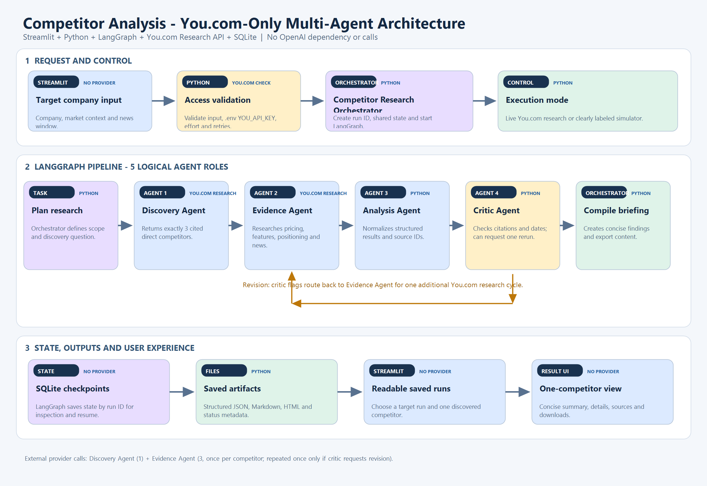

# Multi-Agent Competitor Analysis

A Streamlit and Jupyter project that uses Python, LangGraph, OpenAI, You.com Search and SQLite checkpoints to research one target company. The workflow discovers three relevant competitors, gathers current evidence, extracts structured findings, runs a critic review and lets the user inspect one competitor at a time.



## Features

- Enter any target company, market context and news window in Streamlit.
- Explicit LangGraph stages: plan, discover, collect, extract, critic and compile.
- You.com web/news research with bounded retries and source tracking.
- OpenAI structured extraction and critic review.
- SQLite checkpoints for inspection and resume.
- Readable saved-run labels and a one-competitor results view.
- Markdown and JSON downloads for the selected competitor.
- Clearly labeled simulator when required credentials are absent.

## Setup

1. Create and activate a Python 3.12 virtual environment.
2. Install dependencies:

   ```powershell
   python -m pip install -r requirements.txt
   ```

3. Copy `.env.example` to `.env` and configure `OPENAI_API_KEY` and `YOU_API_KEY`. Never commit `.env`.
4. Start the interface:

   ```powershell
   python -m streamlit run streamlit_app.py
   ```

5. Open the localhost URL printed by Streamlit, enter a target company and run the research.

The app discovers the checkout root automatically. It works when launched directly from
`streamlit_app.py` and when the notebook launches its generated copy under `.research_runs/`.
Keep `competitor_analysis.ipynb` in the repository root because it contains the shared workflow backend.

The notebook contains the same workflow with step-by-step diagrams and logs:

```powershell
jupyter lab competitor_analysis.ipynb
```

## Result flow

One target company is researched per run. The workflow retains three discovered competitors for evidence and traceability. The UI displays only the competitor selected in the dropdown.

## Agent roles

The architecture has five logical agent roles:

1. **Competitor Research Orchestrator** — plans the run, controls LangGraph routing and compiles the final briefing.
2. **Discovery Agent** — discovers three evidence-supported competitors with You.com.
3. **Evidence Agent** — collects pricing, features, positioning and recent-news sources.
4. **Analysis Agent** — converts evidence into structured, cited competitor findings.
5. **Critic Agent** — validates citations, dates and contradictions and can request one revision.

Planning and compilation are two tasks performed by the same orchestrator. The Evidence Agent role is instantiated once for each discovered competitor during a run.

## Credentials and safety

Credentials load from the project `.env` first and are never printed. Generated results, logs and SQLite databases stay under `.research_runs/`, which is excluded from Git. Live research uses external APIs and may incur provider charges.
